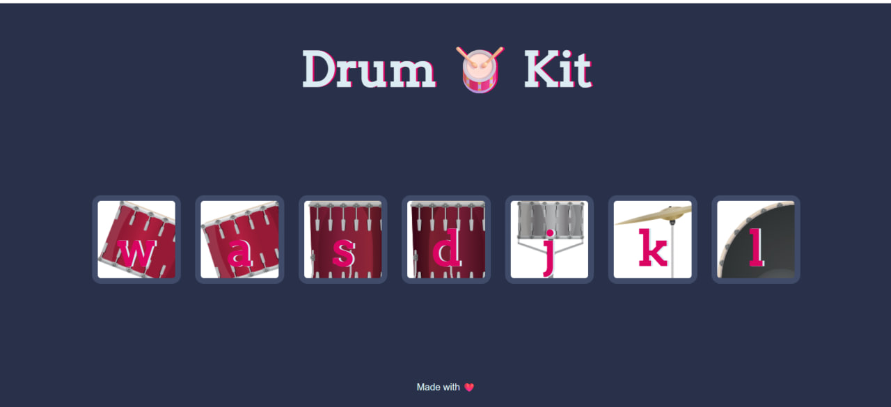

# 🥁 Drum Kit

An interactive web-based drum kit that lets you play drum sounds using your keyboard!

## 🎮 How to Play

Simply press the following keys on your keyboard to play different drum sounds:
- **W** - Tom 1
- **A** - Tom 2
- **S** - Tom 3
- **D** - Tom 4
- **J** - Snare
- **K** - Crash
- **L** - Kick

## 🚀 Getting Started

1. Open `Drum-Kit-Files/index.html` in your web browser
2. Start playing by pressing the keys!

## 🛠️ Built With

- HTML5
- CSS3
- JavaScript

---

Enjoy making music! 🎵
